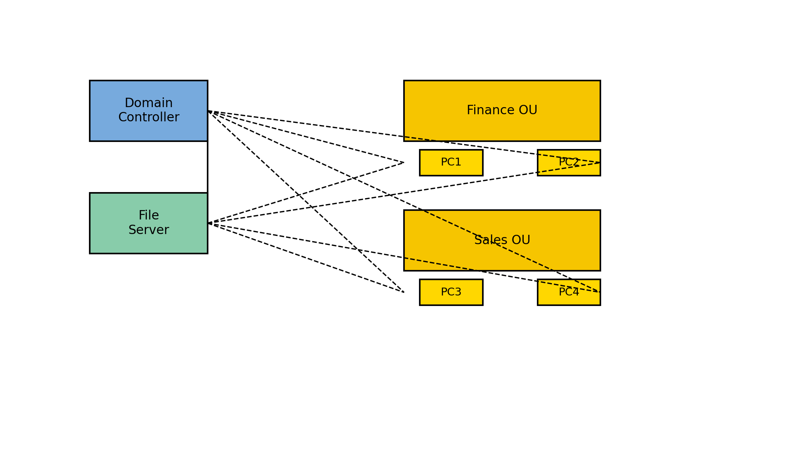

# Windows Server Active Directory & File Share Project

This project simulates setting up a Windows Server domain controller, configuring Active Directory for user and group management, and creating secure file shares with NTFS and share permissions. It demonstrates fundamental system administration tasks in a lab environment.

## Topology

The lab uses a Windows Server VM as a domain controller and file server. Two organizational units (Finance and Sales) are created with user accounts. Client machines join the domain and access a shared folder on the file server.

## Prerequisites

* Virtualization platform (e.g., VMware Workstation, VirtualBox).
* Windows Server installation media and license or evaluation copy.
* At least two client VMs (e.g., Windows 10/11) to join the domain.

## Tools

* **Windows Server** – domain controller and file server.
* **Active Directory Users and Computers (ADUC)** – to create OUs, users and groups.
* **Group Policy Management Editor** – to enforce security policies. Group Policy Objects allow administrators to centrally manage user and computer environments and ensure consistent security settings.
* **Windows File Explorer** – to create shared folders and set NTFS permissions.

## Steps

1. **Install Active Directory Domain Services.** Promote the Windows Server to a domain controller and create a new forest/domain (e.g., `corp.local`). Configure DNS during the promotion wizard.

2. **Create Organizational Units (OUs) and Users.** Use ADUC to create OUs such as Finance and Sales. Add user accounts (`finance_user1`, `sales_user1`, etc.) and security groups to each OU.

3. **Configure a Network File Share.** On the server, create a folder (e.g., `\\FS01\CorpData`). Configure share permissions so that only domain users can access it. Then set NTFS permissions to assign specific rights (Read, Modify, Full Control). NTFS permissions determine what users can do with files and folders, such as reading, writing or deleting them.

4. **Implement Group Policies.** Use Group Policy Management to create GPOs enforcing security policies. For example, set a password complexity and length policy, configure desktop settings for each OU, or map the shared folder as a network drive. Link the GPOs to the appropriate OUs.

5. **Test and Document.** Join client PCs to the domain. Verify that users can authenticate and access the shared folder according to their permissions. Document the configuration with screenshots of ADUC, Group Policy settings, and the file share security tab.

## Next Steps

* Explore additional features like roaming profiles, folder redirection or DFS replication.
* Experiment with advanced GPO settings to enforce security baselines or application restrictions.
